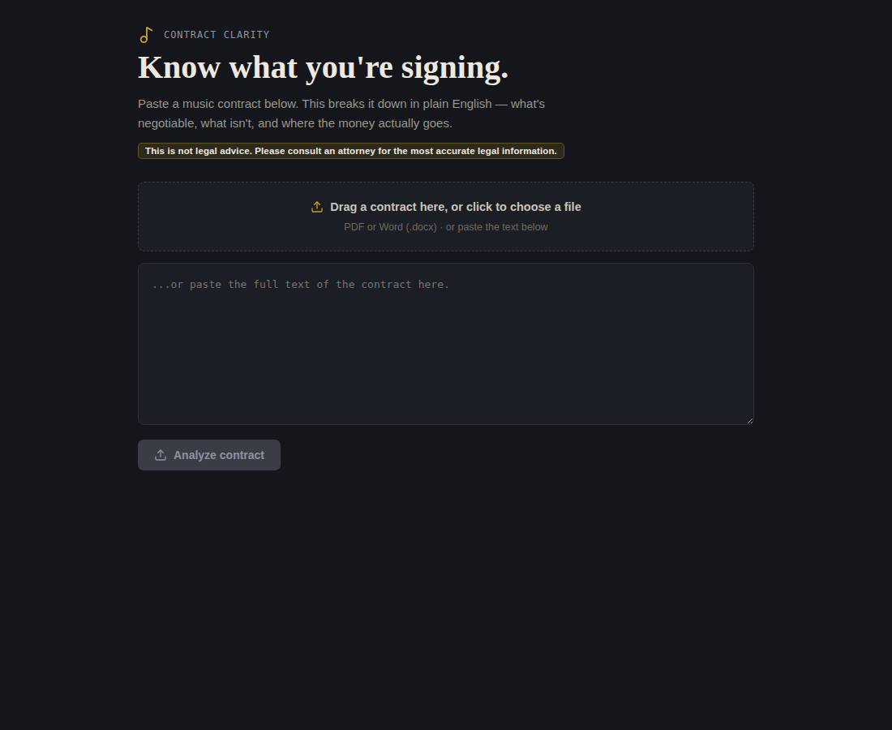

# Contract Clarity

**Know what you're signing.** Contract Clarity reads a music industry contract and explains it in plain English for artists who aren't lawyers: what each clause does, how much long-term harm it could cause, how negotiable it usually is, and where the money goes.



> **This is not legal advice.** Contract Clarity is an educational tool. Talk to an attorney licensed in your contract's governing-law state before signing anything.

## What it does

- **Upload or paste a contract.** PDF and Word (.docx) files are read in the browser. PDFs keep their page numbers, so findings can cite pages.
- **Clause-by-clause breakdown** across six areas: advances, recoupment, publishing rights, merchandising, name/image/likeness, and term and territory. Each one gets:
  - a plain-English explanation
  - a harm rating (low, medium, high) and how long the effect follows the artist
  - a negotiability rating
  - where money is lost or withheld
  - the contract's own section numbers and pages, plus a **Source** button that highlights the exact language the analysis relied on
- **"Worth raising with an attorney"** flag on high-harm clauses.
- **Choice of law and counterparty** pulled from the contract, with a closing reminder to consult an attorney licensed in that state.
- **"What other artists say."** A second pass uses web search to find how musicians describe these clause types, and the named label's or manager's reputation. Every finding carries a plain-language source tag (for example, "This is from Reddit — real people, not verified facts").
- **Copy or download** the full analysis as text.

## How it works

```
Browser (React + Vite)  ──/api──▶  Express server  ──▶  Claude API
  file reading, UI                   holds API key         1. clause analysis
  source highlighting                and prompts           2. research with web search
```

The API key never reaches the browser. The server holds it and makes both calls.

## Run it locally

You need Node.js 18 or newer and an [Anthropic API key](https://console.anthropic.com/). Each analysis makes two API calls, and the research call uses web search, which is billed per search. Set a spend limit in the console while testing.

```bash
git clone <this repo>
cd <this repo>
npm run setup            # installs server and client dependencies
cp .env.example .env     # then put your API key in .env
npm run dev
```

Open the URL Vite prints (usually http://localhost:5173). The backend runs on port 3001.

## Project layout

```
server/server.js                 Express backend: /api/analyze and /api/research
server/prompts.js                The two prompts sent to Claude
client/src/ContractClarity.jsx   The whole front end
docs/BUILD-SPEC.md               Original notes for moving from a Claude artifact to a local app
```

## Known limits

- Scanned or photographed PDFs have no extractable text. Paste the text instead.
- Word files and pasted text have no fixed pages, so only PDFs get page citations.
- Section references depend on the contract's own numbering.
- Source highlighting is fuzzy-matched and can miss on badly formatted documents. The tool says so when it can't find the spot.
- Only the first 12,000 characters of a contract are analyzed.

## License

[GNU Affero General Public License v3.0](LICENSE). You may use, study, and modify this code. If you run a modified version as a network service, you must make your source available to its users.
